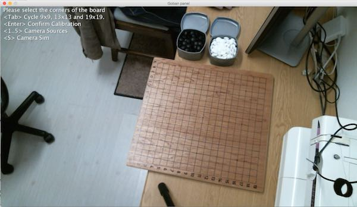
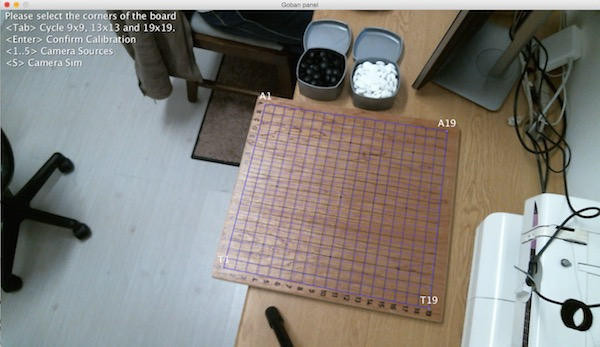
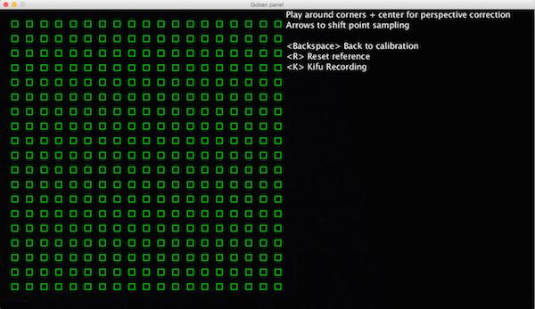
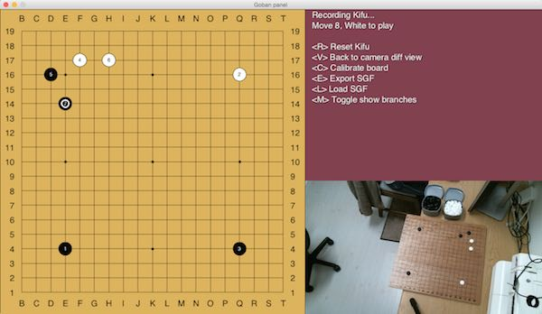
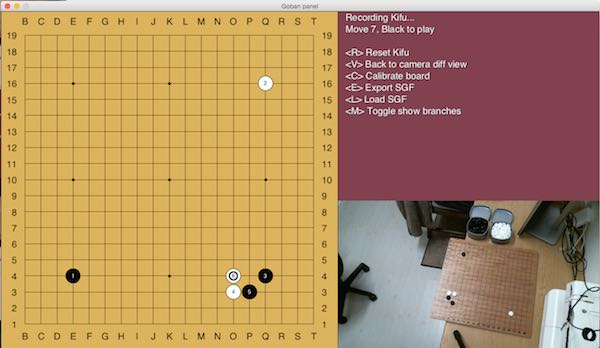
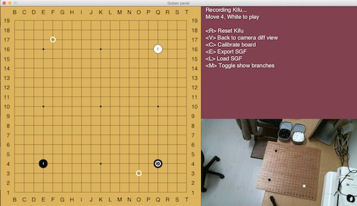

# igoki

Bridge the gap between playing Go on a physical board and digitally.

## Sales pitch
 
 It's handy to see how this works before going into lots of words, so..
 
 As you open igoki, this is what you'll see (after pointing your camera to your board and not your
 face)
 
 
 
 Then you manually click on the four corners, starting with what you perceive as top-left (A19) and going clockwise
  - I usually poke my finger on the board so that I don't have to do mental gymnastics.
 
 
 
 Notice that the light grid is slightly off. Don't mind that, [Issue #12](https://github.com/CmdrDats/igoki/issues/12) will clear that up a bit -
 It's only to show you the size, not where it will pick up the points. That's the next step. Hit `enter`
 and you should see
 
 
 
 The mysteriously black screen shows you the difference between when you got to the screen and currently
 on camera. This is to filter out board grain, shadows and other weirdnesses. Place some stones around
 the board (particularly around the 4 corners and center), and you'll see
 
 
 
 Because my view is quite top-down, it all works out easily, but you'll have to adjust the sampling a
 bit to compensate if you have a lower perspective view of your board (thanks 3D). Issues [#26](https://github.com/CmdrDats/igoki/issues/26) and [#10](https://github.com/CmdrDats/igoki/issues/10)
 will make this slightly better.
 
 Remove the stones and hit `K` to start your game!
 
 
 
 Here you see the interpreted board (empty at the moment) and the camera view - you can head back to
 the diff or calibration view if things are a bit messed up, just don't reset the diff in the middle of your game!
 
 (Coords start at B.. sorry, I'll fix that in [Issue #42](https://github.com/CmdrDats/igoki/issues/42))
 
 After a few moves
 
 
 
 You'll see the move numbers and the last move marked. Feel free to pick up the last stone and explore
 branches, exporting to SGF will save all the branches you create.
 
 If you go back and forth in history, it will highlight any stones that are different (not present,
 or incorrectly present) in red and insist that you fix it before it will branch or continue your game.
 
 
 
 When you've fixed it, you can perhaps play out a different branch
 
 
 
 And when you go back, and switch on the `show branches` mode with `M`, you'll see that both branches
 are indeed recorded
 
 
 
 If you play on either branch, it will continue to show you the next play so that you can see where
 to place the next piece. This makes it possible to load an SGF and review it directly on your board.
 
 When you are reviewing an SGF and explore other branches, igoki will automatically record those branches
 and you can export that straight into another SGF. Being able to comment and apply markup to the
 game will likely only happen after [Issue #41](https://github.com/CmdrDats/igoki/issues/41) is resolved.
 
 ---
 
 I hope this has whetted your appetite enough to install and give it a shot! Please send me feedback,
 as I am keen to hear what you think.
 
## Usage
 
 This project is written in clojure and there is (currently) no binary for it, so you need to install
 leiningen via http://leiningen.org
 
 Once Leiningen is installed, clone this repo and run `lein run`, 
 it will start up the frame and guide you through calibration.
 
 Alternatively, if you are doing development on this project, fire up a `lein repl` and `(start)` 
 to get started.
 

## Goals

The aim of igoki is to enable Go players to play on a physical board, but still have the benefits
of playing via a digital medium:

 - Record your Kifu (game record) automatically as the game progresses
 - Guided reviewing, so that you can review games and explore branches on your physical board easily
 - Direct online playing using integration with online-go.com

It is preferable to setup an external webcam to have a decently lit top-down view of your Go board,
but it can handle a laptop webcam as long as you can fit the whole board into the picture. Sharper
angles do make the stone detection difficult due to stones occluding each other, so try raise your
laptop as high as you can.

When you start, you will be asked to select the 4 points of your board - you can flip between camera
inputs, in case the first selected one is not the one you want to use. Once you have selected
and adjusted that, you will be shown a differenced view where you can shift the sampling points
to take the stone height into consideration.

From there, the Game mode wil allow you to record and export your game into an SGF file.

There is still much to do in the way of features, but the major feature shortlist currently are
 (in oder of priority) :

 - Decent reviewing support: Load SGF, step back and forth through the game, create branches and 
   explore game variations. 
   
 - Online-go integration: Upload game record automatically, play live or correspondence games, watch
   current live games, review games. Play a physical ranked game with two players both providing
   usernames and api keys and then submit the moves on their behalf (allowing to continue
   correspondence games later)
   
 - Feedback onto the board: For the 'next move' on a review or live game, provide some way of
   showing where the coordinate is. First prize is to use a projector to actually project the stone
   onto the board. The route I will currently pursue is to setup an Arduino with 38 LED's
   (19 LED's for a-s and 19 for 1-19), perhaps two more for B/W indication with a serial USB link
   to update the coordinates.
   
## Contributions

This project is still in it's early stages and I'm excited about the possibilities, but I would
dearly appreciate code contributions to the project. If you find this useful but you can't contribute,
 please consider supporting this project by donating to me on paypal : cmdrdats at gmail.com. Thanks! :)
 
## License

Copyright © 2015 Deon Moolman

Distributed under the Eclipse Public License either version 1.0 or (at
your option) any later version.
