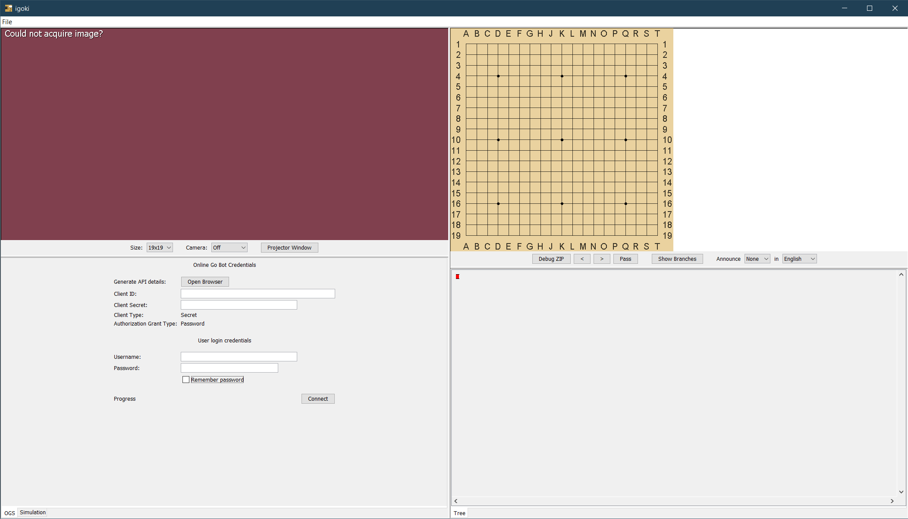
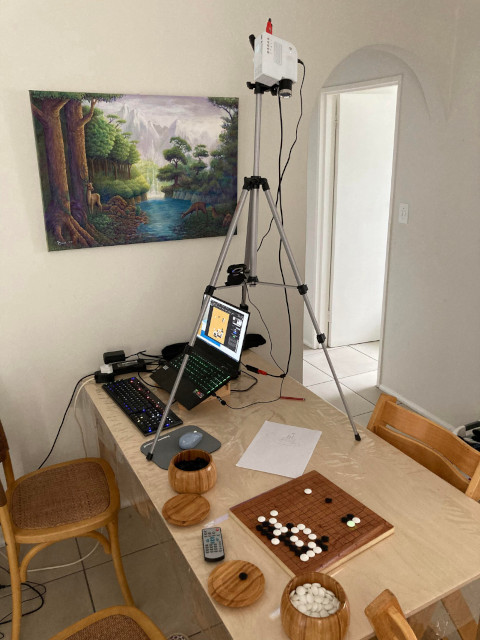
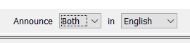
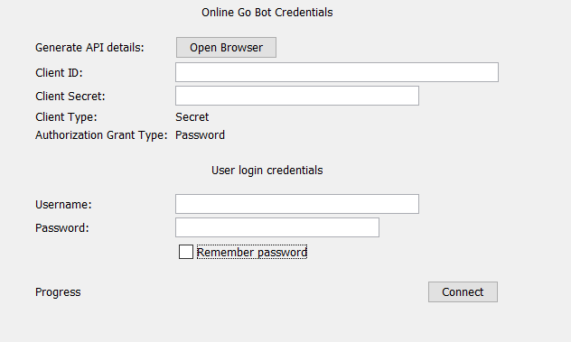
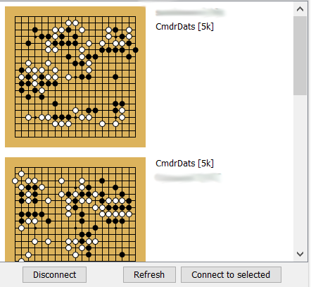
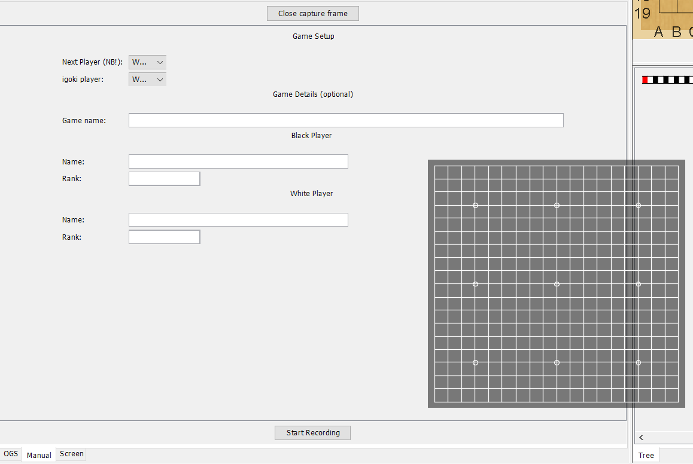

# igoki

Bridge the gap between playing Go on a physical board and digitally.

Reasons for wanting to play on a physical board vary from person to person, for me:
 - I really love the tactile feel of the stones and board and the aesthetic of the game as the stones jostle around.
 - Prefer the serenity of not having to stare at a screen for the game.

igoki lets you do the above while still having the ability to connect and play with people across the internet!

Some things you can do with igoki:
 - Play online (currently online-go.com is implemented, would like to implement more backends)
 - Record a live game between two players
 - Review SGF's

# Support

If you like this project, I would love if you want to jump in and help out with the codebase most of all - 
igoki started out as a proof of concept for me and then gradually grew into what it is today. That means there's
plenty of cobwebs and weird design issues that stem from the lack of coherent upfront design :)

Take a look at the project board here: https://github.com/CmdrDats/igoki/projects/1 - I actively use that to
manage what to focus my efforts on next.

However, if you can't contribute to the codebase, please consider supporting me with a ko-fi donation:

Every little bit will help this project along immensely!
 
# Setup

## Hardware 
It may seem daunting, but the minimum equipment you _really_ need is a webcam and a way to point it with sufficient angle at
a Go board. You can get creative here, even a laptop webcam will do the trick, albeit not the most comfortable.

However, if you want to get the best experience out of the app, you'll want:

 - A PC/Laptop with **Windows**, **Linux** or **OSX** operating systems should all work (please report your mileage)
 - A decent **HD webcam** - really, search for 'webcam hd' on Amazon or wherever - it should do the trick.
 - A **portable projector** of some kind - optional, but really neato - search 'portable projector' - make sure it works 
   with your PC - a standard camera mount screw support will make it easier to attach to tripod.
   I have a rubbish 320x240 low brightness projector, it's a bit a pain, but it works ok.
 - A **tripod** of some description - to mount your webcam and projector. It can be el-cheapo.
 - **USB extension** - usually webcam cables aren't that long, and I find I need an extension to be
   able to put the camera where I want it.

And that's really it, you're good to go.

## Software

Head on over to the [Releases](https://github.com/CmdrDats/igoki/releases) for a universal
java binary that should run most anywhere-ish. You will need a Java runtime installed in order to run it though:

- I have tested with both Java 1.8 and Java 17 - you can head on over to [jdk.java.net](https://jdk.java.net/17/) to 
  download or [java.com](java.com) for java 1.8, though I'll be working off latest Java SDK.
- Once Java is installed, you should be able to double-click the `igoki.jar` and it should run.
- Failing that, on windows you can try:
    - win-r, type `cmd`, hit enter
    - type `cd Downloads` and hit enter (unless you put it somewhere else than in downloads)
    - type `java -jar igoki.jar` and hit enter.
    - It should start. if not, you should get some kind of error. Ping me with a new issue on github
      with that message if that is the case.
- On linux/osx, if you can `java -version` and it gives you the Java version, then you can just:
    - `cd` to the installation folder and `java -jar igoki.jar` 

## Process

To get going, you'll go through the following steps:

1. Setup camera, select the board corners and check that it's reading alright.
2. For Online-Go: Setup API keys, then username/password to login
3. For Manual integration: Setup frame, enter details, start recording
4. For Game Review: Load SGF file
5. For Game recording... just play and Save SGF when you're done!

---

When you start the app, you'll be greeted with:

Going through the various panels:

 - **Camera setup screen** (Top left)
    - Here you will select your board size, camera source 
    - You're also able to open the projector window (more on that later, in the 'Project Setup' section)
 - **Game state screen** (Top right)
    - Here you will see an overview of the current game state and you'll see highlights where igoki
      thinks the stones are, or should be placed.
    - The `Debug ZIP` toggle, when selected, will dump zip files to the `capture` subfolder, which I can use to debug some specific bugs you may encounter
    - The `<` and `>` lets you move forward or backward in the game, `pass` lets you record a pass.
    - `Show Branches` will show you next moves if you aren't at the end of the game - useful for reviewing
    - Announce lets you setup a voice to announce play coordinates. Useful if you don't have a projector, or just want that
      tournament-ish feel where your every recorded move is spoke aloud.
 - **OGS tab** (Bottom left)
    - Online-go integration - we'll cover these in a bit.
 - **Simulation tab** (Bottom left)
    - You can specify a simulation camera in the camera dropdown, and then this will let you
      pretend to have a real camera board. This is useful for when I do dev on various features
      so that I don't have to set everything up.
    - I don't imagine it's particularly useful for anything else, so you can ignore.
 - **Tree tab** (Bottom right
    - Just a tree showing the current game with branches. Nothing fancy.

### Camera calibration

Select a camera in the dropdown until you see your camera feed where you see your board.

Then, point your `finger` to the upper left corner of the board. Click on that corner on the camera
view and then the other 3 corners in a clockwise fashion. I find that provides the most sensible results.

You can click and drag the corners to fine tune them - sometimes you may want to make the view larger
so that you can be a bit more accurate here.

You should see a grid pretty much exactly over your board lines.

Put a bunch of stones down on the intersections around the board and adjust a little so that the
intersections roughly lies on the center on _top_ of the stones. I find that gives a super solid reading result.

### Record your game

If you wanted to simply record your game, that's it, go to `File` -> `New SGF` in case it recorded
some stuff during caliration, and you're all ready to go. `File` -> `Save SGF...` when you're done

If you want to announce your moves while you're playing, set those up in the game panel (upper right)

### Projector setup (optional)

Connect up your projector and get it working in your OS as an extended display - 
some guidance if you need, for windows or OSX: [At this link](https://www.bu.edu/comtech/faculty-staff/classroom-av/instructor-station-desktop-mirroring/)

Once that is setup, make sure the projector is pointed at and covering your entire board with a tiny bit
of space to spare.

Now click the `Projector Window` button in the camera panel - this should open a new
maximized window with a checkerboard pattern:

This is used to pick up the orientation of the camera vs the plane of your game board. Move that
window over to the projector screen and maximize it - the checkerboard should fit on your game board.

Get a blank white sheet of paper and place it so that the checkerboard pattern is fully on the page - 
this will let the camera correctly see the checkerboard pattern.

If all goes well, the checkerboard pattern will disappear and the background of the window will go black.
It's all ready to roll!

### Announcer

Not a hardware setup, but if you want to hear coordinates,
remember to select the color you want to announce for and the language. Particularly useful if no
projector.

### Review a game

At this point, you can very effectively review games.

If you want to review a game, you can `File` -> `Load SGF...` to open the SGF you'd like to review.
Click `Show Branches` for the best experience here.

**A feature to note here:** when you pull stones off the board, igoki will do a backward search for
a previous game state like the one you've gone to, and automatically jump to that point in the game
if it can. If you play a different way, it'll start branching in the SGF. Quite handy for reviewing and
recording variations, I would say!

### Play online on online-go.com

For this you'll need to setup your igoki instance on OGS's API thingy. Click the 'Open Browser' or browse
to [OGS Applications](https://online-go.com/oauth2/applications/) to set this up. I have tried to 
keep the interface consistent with OGS, so the settings will be the same (though I've seen 'Client Type' as 'Secret'
and sometimes 'Confidential' - I'm not sure - both seem the same)

Once you have your application setup and you have a Client ID and Client Secret, plug those in, along
with your normal Username/Password - igoki will remember all the settings, besides password unless you check
that option.

If that's successful, you'll see the game list:

Just click on one and `Connect to selected` - and you should be good to go - Start playing!

### Play online using manual screen capture (very early implementation)

As a stopgap to interact with most other Go clients or programs, you can setup a manual frame
to capture and relay mouse clicks directly on screen.

To set this up, click on the `Manual` tab at the bottom of the screen, then click the
`Open capture frame` button. This will create a floating window that you can drag and align with the game
board you want to integrate with.

Because igoki won't be able to tell move order or anything, you need to let it know who the next
player is that needs to go, and who it will be simulating mouse clicks for. There is a few
more options mostly for the saved SGF at the end:

You can pause the capturing or stop it at any time.

A few notes and tips:

[Sabaki](https://sabaki.yichuanshen.de/) highlights the last move quite strongly, the strong black mark
on the white stone confuses igoki's neural net. I found I get better mileage when I make the sabaki window
quite small if that is a problem.

[Katrain](https://github.com/sanderland/katrain) on windows really wants to have focus before the move
is made, this makes testing with the simulation mode somewhat tricky (it doesn't work unless I jimmy a double click of sorts xD)
- You might find this is the case with different platforms - so focus the app after setup before you start playing.

On jdk 8, there's a bug where the first 'mouse move' command doesn't go to remotely the right place,
so I've just worked around it by telling it to move the mouse 5 times. hopefully that's enough to coerce it, but please
report back.

## Usage
 
 Head on over to the [Releases](https://github.com/CmdrDats/igoki/releases) for a universal
 java binary. 

 This project is written in clojure so if you want to build from scratch, you need to install
 [Leiningen](http://leiningen.org) 
 
 Once Leiningen is installed, clone this repo and run `lein run`, 
 it will start up the frame and guide you through calibration.
 
 Alternatively, if you are doing development on this project, fire up a `lein repl` and it'll
 be all setup to connect an IDE repl to it.

 
## License

Copyright © 2021 Deon Moolman

Distributed under the Eclipse Public License either version 1.0 or (at
your option) any later version.
